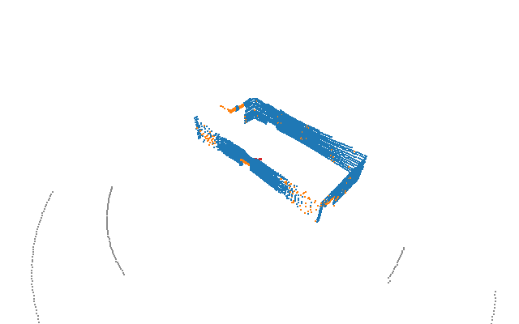
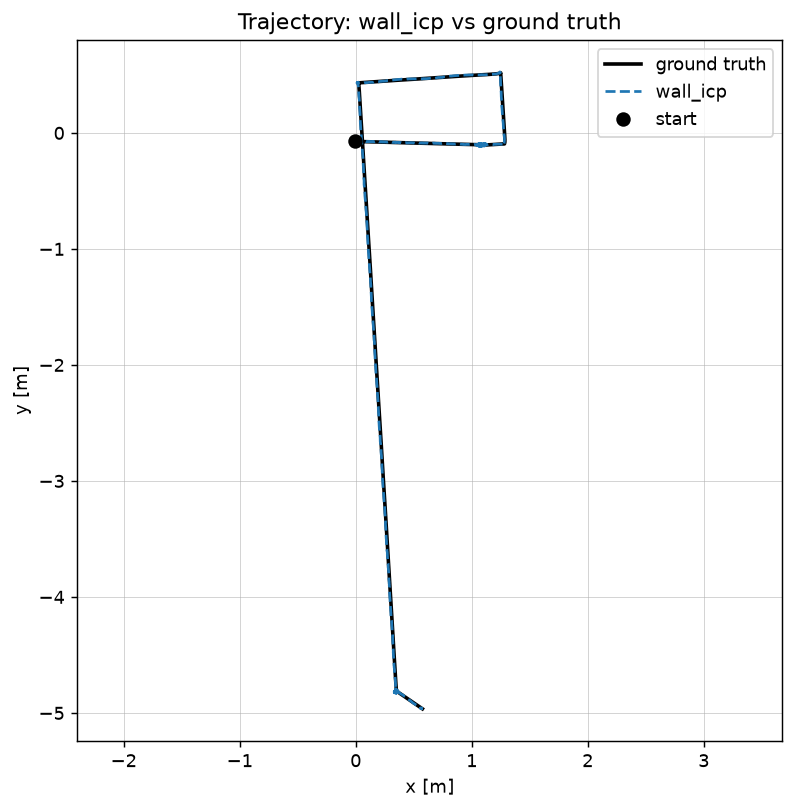
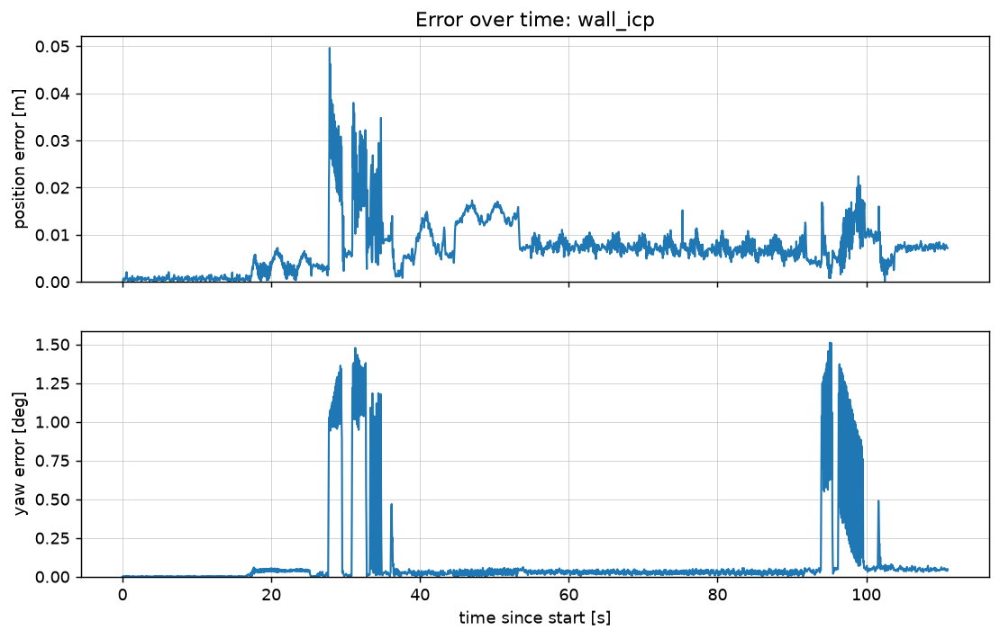
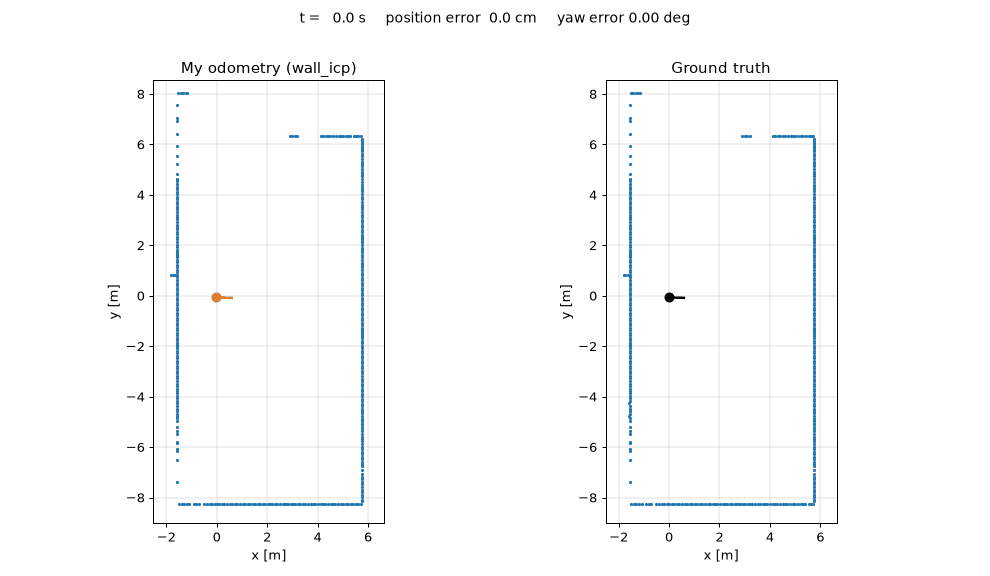

# Indoor LiDAR Odometry

2D odometry (x, y, yaw) for an indoor robot from a Livox 3D LiDAR and an IMU,
using walls as the main feature.

The whole run at 8x speed, in the robot's frame: the robot stays at the centre
and the room moves around it. Blue points are kept as walls, orange are
rejected by the wall test, grey are floor, red are the robot's own body.

## What it does

The robot drives about 9 m around one room. For every LiDAR scan I estimate
where the robot is and which way it faces, without using the ground truth
that comes with the bag.

My method (`wall_icp`) in short:

1. Throw away the floor and the robot's own body, keep only points that sit
   on vertical surfaces, and flatten them to a top-down view. About 8000
   points per scan become about 430.
2. Keep the wall points of earlier scans as a map of the room. The robot
   stands still for the first 16 s, so most of the map is built from a known
   spot.
3. For each new scan, start from the last pose plus what the gyro says the
   robot turned, then shift and turn the scan until its points sit on the
   walls in the map (point-to-line ICP). That gives the pose.

The map never overwrites a cell once it is filled, which is why the error
does not build up over the run.

## Results

Scored against the `odom -> base_link` transform in the bag, over all 2220 scans.

| method | ATE best fit | ATE first pose | yaw error mean | yaw error max | speed |
|---|---|---|---|---|---|
| `wall_icp` (mine, submitted) | 0.008 m | 0.010 m | 0.09 deg | 1.70 deg | ~230 Hz |
| `wall_lines` | 0.008 m | 0.009 m | 0.12 deg | 1.17 deg | ~490 Hz |
| `kiss` (KISS-ICP) | 0.012 m | 0.014 m | 0.10 deg | 1.60 deg | ~150 Hz |
| `imu_only` | 16.36 m | 26.28 m | 0.49 deg | 1.84 deg | - |

The LiDAR runs at 20 Hz, so all of them are well past real time. Speeds are
from my laptop and move around a lot depending on what else is running.

ATE is given two ways. "Best fit" lines the whole path up with the ground
truth as well as possible first, which is the usual definition. "First pose"
only pins the two paths together at the start, which is stricter. Yaw error
uses the first pose alignment.

Nearly all of the error is in the two turns (around 27-35 s and 94-100 s).

### Side by side with the ground truth

Left: every scan's wall points placed in the room using my pose for that
scan, with my path in orange. Right: the same points placed using the
ground-truth pose. If my poses were off, the walls on the left would smear
or drift away from the picture on the right. The line at the top shows the
error at that moment.

### The trajectory file

`results/wall_icp.csv` is what I submit. One row per LiDAR scan:

| column | meaning |
|---|---|
| `t` | scan time from the message header [s] |
| `x`, `y` | position of `base_link` [m] |
| `yaw_deg` | heading of `base_link` [degrees], not wrapped |

**The trajectory starts at (0, 0) facing 0 deg**, because an odometry has no
way of knowing where the ground-truth frame puts its origin. The ground truth
starts at (-0.007, -0.066) facing -1.585 deg. So the two have to be lined up
before they are compared, either at the first pose or by a best fit over the
whole path. Subtracting the files directly would mostly measure that offset.
`evaluate.py` does both alignments.

## Setup

I used Python 3.11 on Windows. No ROS is needed, the bag is read with the
`rosbags` package.

    python -m venv .venv
    .venv\Scripts\python -m pip install -r requirements.txt

On Linux or macOS use `.venv/bin/python` in place of `.venv\Scripts\python`
everywhere below.

The bag is not in the repo (224 MB). Unpack it so that this file exists:

    data/rosbag/metadata.yaml

## How to run everything

All commands are run from the repo root.

**1. Read the bag once** (slow, but only needed once; writes `cache/sensors.npz`):

    .venv\Scripts\python -m lidar_odom.extract data\rosbag cache\sensors.npz

**2. Export the ground truth** for scoring (writes `cache/gt.csv`):

    .venv\Scripts\python -m lidar_odom.extract_gt data\rosbag cache\gt.csv

**3. Run a method.** This writes `results/<name>.csv` with one row per scan
(`t, x, y, yaw_deg`) and prints the speed:

    .venv\Scripts\python -m lidar_odom.run wall_icp

The other names are `wall_lines`, `kiss` and `imu_only`.

**4. Score it.** Prints ATE and yaw error and writes the two plots to
`figures/`:

    .venv\Scripts\python -m lidar_odom.evaluate wall_icp

That is the whole pipeline. `results/wall_icp.csv` is the trajectory I submit.

### Optional extras

Look at the raw data (writes `figures/scans_raw.png` and `figures/imu_raw.png`):

    .venv\Scripts\python -m lidar_odom.visualize cache\sensors.npz figures

See what preprocessing keeps (writes `figures/preprocess.png`):

    .venv\Scripts\python -m lidar_odom.preprocess cache\sensors.npz figures

Watch the run in 3D. The number at the end is the playback speed, space pauses:

    .venv\Scripts\python -m lidar_odom.view3d cache\sensors.npz 4

Rebuild the GIF at the top of this page:

    .venv\Scripts\python -m lidar_odom.make_gif cache\sensors.npz figures\playback.gif

Rebuild the side by side comparison with the ground truth:

    .venv\Scripts\python -m lidar_odom.make_comparison wall_icp figures\comparison.gif

Measure the LiDAR's time lag behind the IMU (see the note on timing below):

    .venv\Scripts\python -m lidar_odom.lidar_delay

## What is in the repo

    lidar_odom/
      extract.py        bag -> cache/sensors.npz (lidar, imu, lidar mount)
      extract_gt.py     bag -> cache/gt.csv (ground truth, for scoring only)
      visualize.py      plots of the raw scans and the raw imu
      preprocess.py     one 3D scan -> 2D wall points in base_link
      imu.py            standstill detection, gyro bias, yaw from the gyro
      run.py            runs one method and saves its trajectory
      evaluate.py       ATE, yaw error and the plots
      view3d.py         3D playback of the run
      make_gif.py       the same playback saved as a GIF
      make_comparison.py  my odometry next to ground truth, as a GIF
      lidar_delay.py    measures the lidar/imu time offset
      algos/
        wall_icp.py     my method: point-to-line ICP against a wall map
        wall_lines.py   comparison: RANSAC wall lines matched to a line map
        kiss.py         comparison: KISS-ICP, off the shelf
        imu_only.py     baseline: gyro for heading, accelerometer for position
    results/            one trajectory csv per method
    figures/            plots and the GIF

Every file in `algos/` has the same `run(data)` function. It gets the sensor
cache and returns one `(x, y, yaw)` per scan, for `base_link`, starting at
zero.

## The other methods

I built these to have something to compare against.

- **`imu_only`** is what you get with no LiDAR. The heading from the gyro is
  fine. The position, from integrating the accelerometer twice, ends up 68 m
  away from where the robot really is. That is why the accelerometer is not
  used anywhere else.
- **`wall_lines`** also uses walls, but turns each wall into a straight line
  (found with RANSAC) and reads the pose off how the lines have moved. It is
  about twice as fast and just as accurate here. It needs the walls to be
  straight, which `wall_icp` does not.
- **`kiss`** is KISS-ICP run as it comes, on the 3D points, with no knowledge
  of walls or the IMU. It gets within about a centimetre as well, which says
  this room is not a hard case.

## Ground truth

The bag contains ground truth. It is read by `extract_gt.py` and opened only
by `evaluate.py` and `make_comparison.py`, which are both for checking the
result. None of the methods load it; they only ever see
`cache/sensors.npz`, which has no ground truth in it.

There are actually two copies in the bag, `/odom_sim` and the
`odom -> base_link` transform on `/tf`, and they are one sample (50 ms) apart
from each other. I score against the transform because that is the one the
assignment names.

## A note on timing

My error sits almost entirely in the turns, and it follows how fast the robot
is turning, which looks like a clock problem. `lidar_delay.py` compares the
heading from the LiDAR with the heading from the gyro and finds that the scans
are about 80 ms behind the IMU.

`wall_icp.py` can correct for this (`LIDAR_DELAY`). I tried it. Against the
transform it made no real difference (yaw error 0.09 deg without, 0.10 deg
with), so I left it switched off and kept the method simple. Sorting the
timing out properly is the obvious next thing to do.

## Things that would break it

- A long corridor with walls in only one direction. Nothing would stop the
  scan sliding along them.
- A robot that starts moving straight away. The map would be built from poses
  that already have some error in them.
- A building bigger than one room, where the first walls go out of sight.
- Scans with extra fields per point. `extract.py` assumes each point is
  exactly x, y, z as float32.
